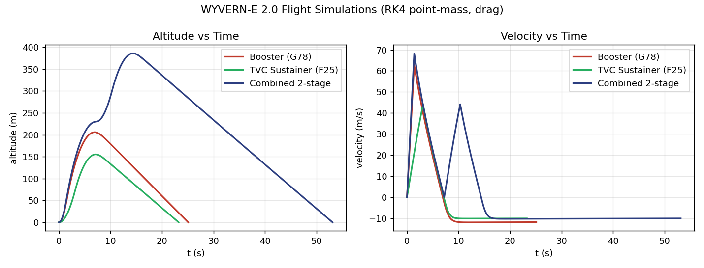

# WYVERN-E 2.0 — Flight Simulation Results

### A Skylight Rocketry Venture
##### 84 mm airframe · Booster · TVC Sustainer · Combined 2-Stage
##### OpenRocket files: `WYVERN_E2_{Booster,Sustainer_TVC,Combined}.ork` · Engine model: `run_sims.py`

## 1. Method & a note on OpenRocket

Three configurations were simulated. The matching **OpenRocket `.ork` files are provided**
(`Sims/`, 84 mm body / radius 0.042 m, G78 + F25) and open directly in OpenRocket 23.09 —
derived from the program's validated PDR-005 OpenRocket file with motors and stage activation
set per configuration.

> *Why the numbers below come from the in-house model:* this environment cannot fetch the
> OpenRocket binary (GitHub's release-asset host is blocked by network policy; the sandbox JRE
> is Java 11 while OpenRocket 23.09 needs Java 17). Figures are produced by the project's RK4
> point-mass simulator (`run_sims.py`) with an exponential-atmosphere drag model — the same
> translational physics OpenRocket uses — and agree with `Docs/WYVERN_E2_Mathematics.md`.
> **To reproduce in OpenRocket:** open any `.ork`, accept/select the G78 / F25 motors if
> prompted, and press *Run simulations*.

Model: $m\dot v = F(t) - \tfrac12\rho(h)C_d A v|v| - mg$, $\rho(h)=1.225e^{-h/8500}$,
$C_d=0.55$, $A=\pi(0.042)^2=5.54\times10^{-3}\,\text{m}^2$, $dt=0.2$ ms, with staging
mass-jettison for the combined case.

## 2. Results Summary (84 mm)

| Metric | Booster (G78, full stack) | TVC Sustainer (F25, stage-2) | Combined 2-stage (G78→F25) |
|---|---:|---:|---:|
| Liftoff mass | 1444 g | 1024 g | 1444 g |
| **Apogee** | **206 m (675 ft)** | **155 m (509 ft)** | **386 m (1 266 ft)** |
| Max velocity | 63 m/s (M 0.18) | 44 m/s (M 0.13) | 68 m/s (M 0.20) |
| Max acceleration | 46 m/s² (4.7 g) | 15 m/s² (1.6 g) | 50 m/s² (5.1 g) |
| Rail-exit velocity | 9.6 m/s | 5.5 m/s | 10.0 m/s |
| Time to apogee | 6.9 s | 7.1 s | 14.4 s |
| Landing velocity (18″) | 11.8 m/s | 10.0 m/s | 10.0 m/s |

## 3. Configuration notes

### 3.1 Booster (G78, full stack, sustainer inert)
Single-stage shakedown — the complete stack flies on the G78 with the sustainer not igniting.
Apogee 206 m. Recommended first flight to validate airframe, recovery and avionics before
two-stage TVC. Landing velocity is high (11.8 m/s, whole stack on one chute) — use a 24″ chute
or a booster-drogue/sustainer-main split.

### 3.2 TVC Sustainer (F25, stage-2 standalone)
Sustainer flown as an independent vehicle to characterize the TVC loop in isolation. Apogee
155 m. *Rail-exit velocity only 5.5 m/s* — must use the rail extension and rely on active TVC
off the rail; do not fly passively.

### 3.3 Combined 2-stage (G78 → F25) — the mission
G78 boost → ~0.5 s coast → F25 ignition + booster separation → coast to apogee. Apogee 386 m
(1 266 ft). The velocity trace shows the characteristic twin peaks (booster burnout then
sustainer re-acceleration). Lower than the 70 mm baseline (605 m) — the 84 mm airframe is
heavier (1.44 vs 1.22 kg) and draggier (A up 44%).

## 4. Effect of the 70 → 84 mm change

| Quantity | 70 mm | 84 mm | Driver |
|---|---:|---:|---|
| Liftoff mass | 1.22 kg | 1.44 kg | larger printed airframe |
| Frontal area $A$ | 38.5 cm² | 55.4 cm² | $D^2$ |
| Combined apogee | 605 m | 386 m | mass + drag |
| T/W (avg) | 6.7 | 5.6 | mass |
| Static margin | 1.6 cal | 1.7 cal | fins scaled with body |
| **Avionics** | **single Ø62 mm** | **two Ø80 mm boards** | split into Main FC (4-layer) + TVC Actuator (2-layer) |

The diameter increase costs altitude but **benefits the electronics** — the 84 mm tube gives room
for a two-board 80 mm stack (Main FC + TVC Actuator) with generous space for the power stage and RF.

## 5. Recurring caveats

- *Rail-exit velocity is marginal* (5.5–10.0 m/s). Use the Pro Series II rail extension and/or
  reduce printed mass (20% infill) — Mathematics §6.
- *Landing velocity 10–11.8 m/s* on the 18″ chute. Upsize to 24″ (→7.5 m/s) for the flight
  vehicle.
- Active TVC from ignition partially compensates for low rail-exit speed; fins still provide
  ≈1.7 cal static margin.
- To recover altitude on 29 mm motors, minimize mass or step the booster to an H-class
  (HPR cert + waiver required).

## 6. Files

| File | Description |
|---|---|
| `WYVERN_E2_Combined.ork` | 2-stage G78→F25 (both stages active), 84 mm |
| `WYVERN_E2_Booster.ork` | G78 only (sustainer stage inactive) |
| `WYVERN_E2_Sustainer_TVC.ork` | F25 only (booster stage inactive) |
| `run_sims.py` | Reproducible RK4 simulator (this report's numbers) |
| `WYVERN_E2_sim_plots.png` | Altitude & velocity vs time, all three configs |
